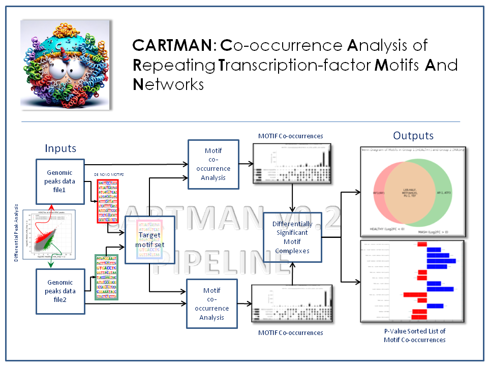

## Abstract

The observation that similar sets of transcription factor motifs are sometimes found in **not** so simlar cellular phenotypes suggests that gene expression maybe a function of specific combinatorial arrangement(s) of the motifs within the regulatory segments of DNA. Deciphering the relationship between regulatory sequences and gene expression necessitates exploring complex sequence structures beyond individual motifs. **CARTMAN** (Co-occurrence Analysis of Repeating Transcription-factor Motifs And Networks) is a computational tool designed to discover and quantify motif co-occurrences within regulatory sequences. It facilitates downstream differential analysis of multi-motif complexes across distinct experimental conditions. Unlike high-complexity machine learning approaches that often produce inferred measures, CARTMAN delivers direct and interpretable metrics with minimal computational overhead and requires only basic user expertise. Building upon outputs from tools like HOMER and FIMO, CARTMAN represents a natural progression to basic motif discovery tools.

## Statistical Interpretability in Data-Sparse Contexts

CARTMAN faciliates a formal probabilistic prediction model. It systematically enumerates motif combinations, estimates their co-occurrence frequencies to allow computation of statistical significance for each configuration, to produce p-value based probability separations of motif combinations that correlate with regulatory changes such as histone acetylation. This predictive analysis is grounded in explicit probabilities rather than black-box trained decision functions.

## A Departure from Traditional Machine Learning

An SVM or a deep learning based classifier could, in principle, be trained on motif presence vectors, but given the relatively modest number of loci and the strong interdependence of motif features, such models tend to overfit and yield unstable decision boundaries. Also, while discriminative classifiers can produce class probabilities, these represent model-derived likelihoods rather than hypothesis-test probabilities that are more appropriate for quantifying statistical enrichment under an explicit null model. The advantage of CARTMAN is that it doesn't rely on large-sample generalizations; it provides interpretable probability estimates through direct statistical inference. The result is rigorous, mechanistically interpretable separations of motif configurations rather than performance-optimized black boxes.

## Citation   

If you use CARTMAN in your work, please reference it as follows:

Saisan, P., & Glass, C. (2024). CARTMAN: Co-occurrence analysis of repeating transcription-factor motifs and networks (Version 0.1) [Computer software]. GitHub. https://github.com/psaisan/CARTMAN

[]()

### BibTeX Entry

```bibtex
@misc{saisan2024cartman,
  author       = {Saisan, P. and Glass, C.},
  title        = {CARTMAN: Co-occurrence Analysis of Repeating Transcription-factor Motifs And Networks},
  year         = {2024},
  publisher    = {GitHub},
  howpublished = {\url{https://github.com/psaisan/CARTMAN}},
  version      = {0.1},
}
```


## Installation

### Prerequisites

- **Python 3.7+**
- **HOMER Suite:** Ensure that [HOMER](http://homer.ucsd.edu) is installed and accessible in your system's PATH.

### Steps

1. **Clone the Repository**

   ```bash
   git clone https://github.com/psaisan/CARTMAN.git
   cd CARTMAN
   
# Example Notebook

[View the CARTMAN Example Notebook](./Notebooks/CARTMAN_Example.ipynb)


## Data Source

The data used in this example is from a 2020 study, [Seidman et al](https://pubmed.ncbi.nlm.nih.gov/32362324/), looking at epigenomic changes in the immune system cells (Kupffer) as they undergo a diet induced transformation.

1. Peak file1: Regulatory DNA regions active in HEALTHY Kupffer cells 

**`KCH_H3K_FC2_1000_w200.txt`** 

2. Peak file2: Regulatory DNA regions active  in [MASH](https://en.wikipedia.org/wiki/Metabolic_dysfunction%E2%80%93associated_steatotic_liver_disease) transformed Kupffer cells 

**`KCN_H3K_FC2_1000_w200.txt`** 

3. Target motif list file: Subset of HOMER identified motifs found in HEALTHY and MASH Kupffer cells 
   
**`KCH_VS_KCN_w400_L70.motifs`**

Full datase on GEO: [GSE128338](https://www.ncbi.nlm.nih.gov/geo/query/acc.cgi?acc=GSE128338)


