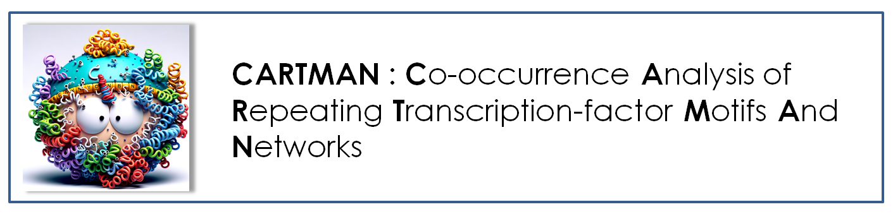

## Abstract

Understanding gene regulation requires exploring complex genomic sequence structures beyond individual transcription factor motifs. **CARTMAN** (Co-occurrence Analysis of Repeating Transcription-factor Motifs And Networks) is a software tool that enables the discovery and quantification of motif co-occurrences within regulatory sequences and performs differential analysis of motif complexes across distinct experimental conditions. Unlike high-complexity machine learning approaches, CARTMAN offers straightforward and interpretable measures minimizing computational overhead and user background requirements. CARTMAN’s motif co-occurrence constructs parallel the simplicity and interpretability of motifs as co-occurrence of individual nucleotides, representing a logical and natural progression of well-established genomic motif discovery tools like [HOMER](http://homer.ucsd.edu/homer/) and [FIMO](https://meme-suite.org/meme/tools/fimo).


## Citation   

If you use CARTMAN in your work, please reference it as follows:

Saisan, P., & Glass, C. (2024). **CARTMAN: Co-occurrence Analysis of Repeating Transcription-factor Motifs And Networks** (Version 1.0) [Computer software]. GitHub. Retrieved from [https://github.com/psaisan/CARTMAN](https://github.com/psaisan/CARTMAN)

### BibTeX Entry

```bibtex
@misc{saisan2024cartman,
  author       = {Saisan, P. and Glass, C.},
  title        = {CARTMAN: Co-occurrence Analysis of Repeating Transcription-factor Motifs And Networks},
  year         = {2024},
  publisher    = {GitHub},
  howpublished = {\url{https://github.com/psaisan/CARTMAN}},
  version      = {1.0},
}
```


## Features

- **Motif Co-occurrence Table Generation:** Given a set of target motifs file and a genomic peaks file, CARTMAN constructs and quantifies all possible motif combinations found within the genomic peaks. 
- **Differential Analysis:** Compares motif co-occurrence between two peak sets to identify significant differences.
- **Result Integration:** Outputs normalized counts and significance levels and a number of different visualizations of the motif co-occurances in peak files.

---

## Installation

### Prerequisites

- **Python 3.7+**
- **HOMER Suite:** Ensure HOMER is installed and accessible in your system's PATH.

### Steps

1. **Clone the Repository**

   ```bash
   git clone https://github.com/psaisan/CARTMAN.git
   cd CARTMAN
   
---


# Function Reference

- [read_motif_headers](#read_motif_headers)
- [read_motif_headers_jaspar](#read_motif_headers_jaspar)
- [read_motif_headers_homer](#read_motif_headers_homer)
- [get_motif_count](#get_motif_count)
- [get_motif_count_loc](#get_motif_count_loc)
- [ensure_directory_exists](#ensure_directory_exists)
- [transform_combinations_to_matrix](#transform_combinations_to_matrix)
- [calculate_motif_distance](#calculate_motif_distance)
- [find_co_occurring_motifs](#find_co_occurring_motifs)
- [calculate_all_motif_co_occurrences](#calculate_all_motif_co_occurrences)
- [all_possible_combinations33](#all_possible_combinations33)
- [peak_motif_sets](#peak_motif_sets)

## Function Descriptions

<a name="read_motif_headers"></a>
## read_motif_headers

`motif_names = read_motif_headers(motif_file)`

Reads headers from a motif file to extract motif names.

<a name="read_motif_headers_jaspar"></a>
## read_motif_headers_jaspar

`motif_names = read_motif_headers_jaspar(motif_file)`

Reads headers from a JASPAR motif file to extract motif names.

<a name="read_motif_headers_homer"></a>
## read_motif_headers_homer

`motif_names = read_motif_headers_homer(motif_file)`

Reads headers from a HOMER motif file to extract motif names.

<a name="get_motif_count"></a>
## get_motif_count

`motif_count_table, motif_count_file = get_motif_count(peak_file, genome, motif_file, output_directory, force)`

Gets motif count using HOMER annotatePeaks.

<a name="get_motif_count_loc"></a>
## get_motif_count_loc

`motif_count_table, motif_count_file = get_motif_count_loc(peak_file, genome, motif_file, output_directory, force)`

Gets motif count with positions using HOMER annotatePeaks.

<a name="ensure_directory_exists"></a>
## ensure_directory_exists

`ensure_directory_exists(output_directory)`

Ensures that the specified directory exists, creating it if necessary.

<a name="transform_combinations_to_matrix"></a>
## transform_combinations_to_matrix

`result_df = transform_combinations_to_matrix(series, peak_file)`

Transforms motif combinations to a binary matrix representation.

<a name="calculate_motif_distance"></a>
## calculate_motif_distance

`distance = calculate_motif_distance(s1, s2)`

Calculates the distance between two motif positions.

<a name="find_co_occurring_motifs"></a>
## find_co_occurring_motifs

`co_occurrences = find_co_occurring_motifs(row, max_distance)`

Finds co-occurring motifs within a specified maximum distance.

<a name="calculate_all_motif_co_occurrences"></a>
## calculate_all_motif_co_occurrences

`binary_df, category_counts = calculate_all_motif_co_occurrences(df, max_distance)`

Calculates all motif co-occurrences within a specified maximum distance.

<a name="all_possible_combinations33"></a>
## all_possible_combinations33

`combinations = all_possible_combinations33(df, min_set_count)`

Generates all possible combinations of motifs with a minimum set count.

<a name="peak_motif_sets"></a>
## peak_motif_sets

`sorted_data, binary_table = peak_motif_sets(peak_file, genome, motif_list_file, output_directory)`

Processes motif analysis and generates an UpSet plot.

Processes motif analysis and generates an UpSet plot.
`sorted_data, binary_table = peak_motif_sets(peak_file, genome, motif_list_file, output_directory)`

Processes motif analysis and generates an UpSet plot.
